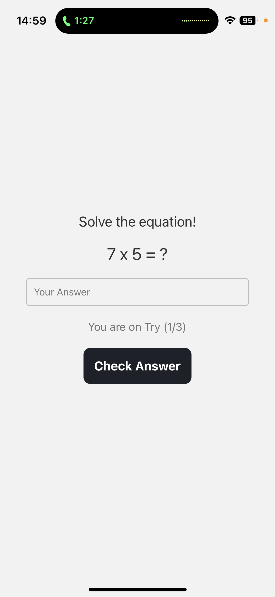

# WakeMeApp

## Functionalities

- [x] Schedule, toggle and delete alarm
- [x] Notifications on alarm
- [x] Barcode scan challenge
- [x] Math challenge
- [x] Riddle challenge
- [x] Streak counter
- [x] Motivational quotes

## Development

### Prerequisites

- [Node.js](https://nodejs.org/)
- [Yarn](https://yarnpkg.com/) or [npm](https://www.npmjs.com/)
- [Expo CLI](https://docs.expo.dev/more/expo-cli/)
- [Expo Go](https://expo.dev/client)

Install `node_modules` in the root directory.

```
yarn install
```

Run in the root directory to start the app and scan the QR code with your phone.

```
npx expo start --go
```

### Screenshots





### Note

This app was tested with iPhone 11 and 15.
